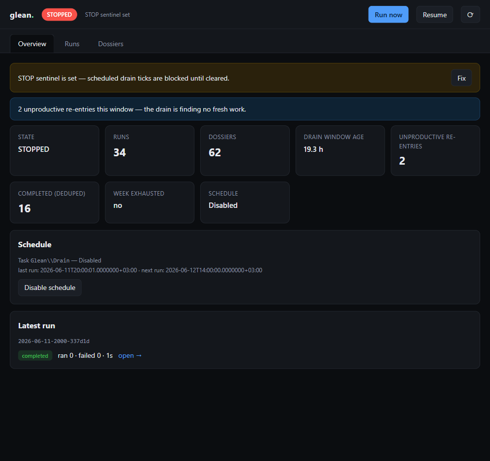
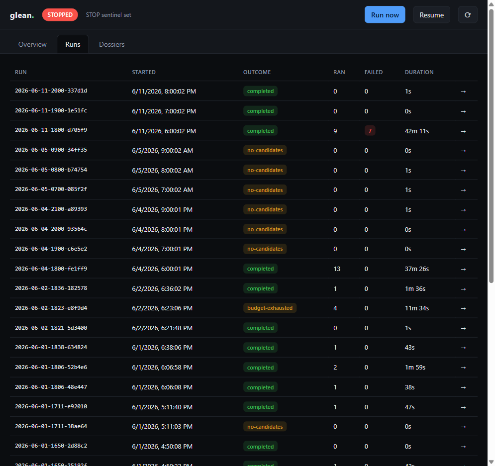
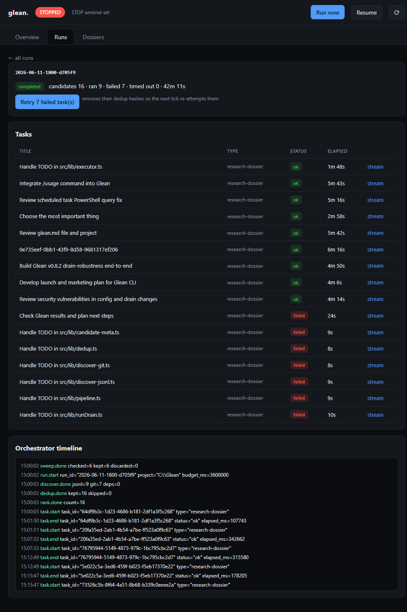
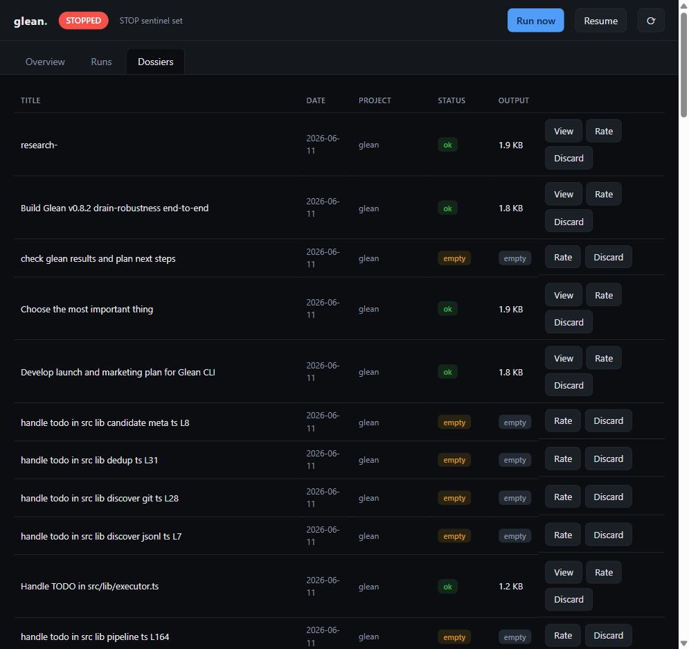
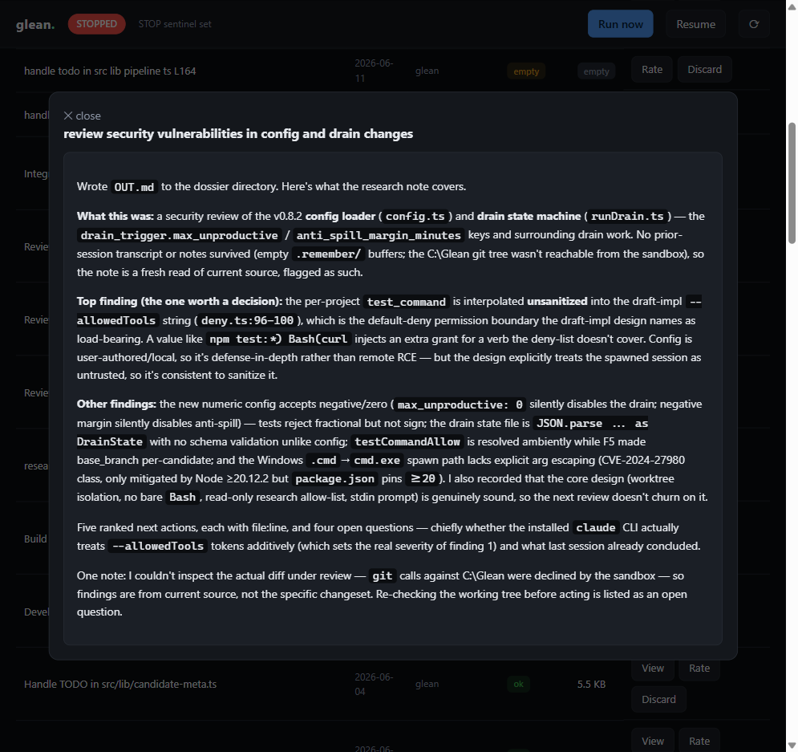
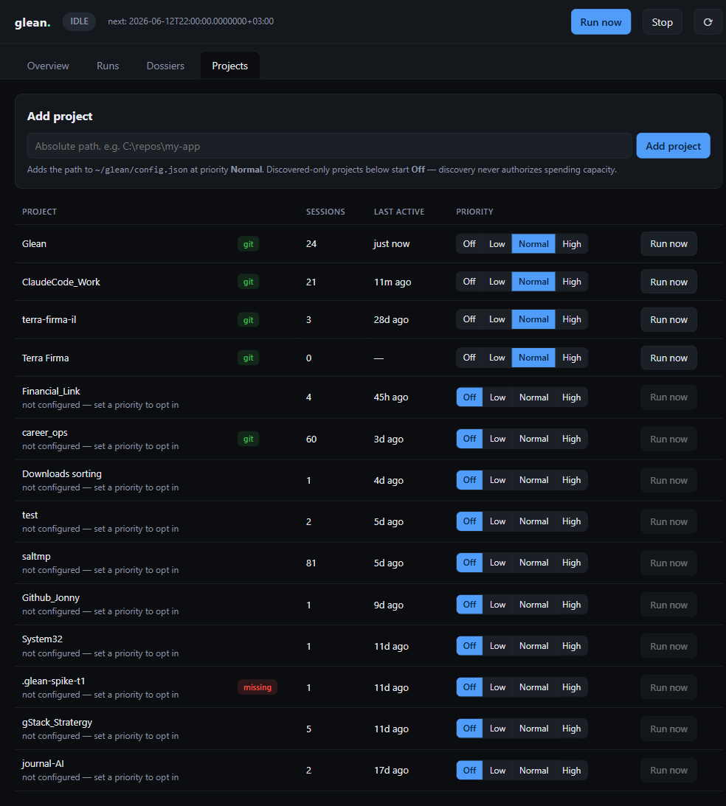

# The glean dashboard (`glean serve`)

`glean serve` launches a local web dashboard for **viewing and managing**
everything glean does — runs, dossiers, the drain budget, the schedule, and the
STOP sentinel — in one place. The CLI receipts (`glean today` / `morning` /
`peek`) tell you what happened; the dashboard lets you *act* on it.

## Start it

```bash
glean serve            # http://127.0.0.1:4317
glean serve --open     # ...and open it in your browser
glean serve --port 8080
```

The server binds to **127.0.0.1 only** and holds a full management surface (it
can start drain runs and edit drain state), so it is intentionally not
reachable from the network. Press `Ctrl+C` to stop it. It reads live from
`~/glean/` and polls every 5 seconds, so you can leave it open during a drain.

## Overview tab



> Screenshots are slightly behind the current UI (they predate the Capacity
> panel and the relative timestamps).

The always-visible status bar shows the current state pill
(`RUNNING` / `IDLE` / `STOPPED`), what it's doing, and the primary actions:

- **Run now** — start a drain tick for a configured project (see
  [Configure a project](#configure-a-project-for-run-now)).
- **Stop** / **Resume** — write or clear the `~/glean/STOP` sentinel. While STOP
  is set, every scheduled drain tick is blocked.
- **⟳** — force a refresh.

Below the bar:

- **Health banners** surface problems with a one-click **Fix**. Two it catches
  automatically: a STOP sentinel left set (blocks the schedule), and a recent
  run with failed tasks (which are otherwise dedup-skipped and never retried).
- **Stat cards**: run/dossier counts, drain-window age, unproductive re-entries,
  deduped-completed count, week-exhausted, and schedule state.
- **Capacity** panel: the last session-window signal glean captured — the
  structured `rate_limit_event` telemetry `claude -p` emits into each task's
  stream log (`~/glean/logs/<run>/<task>.jsonl`). Shows utilization as a
  colored gauge with a % label (green / amber ≥70% / red ≥90%), the window
  type (e.g. `five hour`), the status badge (`allowed` / `allowed_warning` /
  anything else in red), a live "resets in Xh Ym" countdown, and when/where
  the signal was captured. Utilization is sometimes absent from real events
  (plain `allowed` and `rejected` events omit it) — the panel says
  "utilization unknown" rather than inventing a number, and when no run has
  captured any telemetry at all it shows an honest empty state. Note this is
  *last observed* data from the most recent runs, not a live probe — glean
  deliberately has no headless `claude usage` query.
- **Schedule** section: the `Glean\Drain` task's state plus last/next run, with
  an enable/disable button.
- **Latest run** card with a jump link into its detail.

Timestamps across the dashboard render as relative times ("2h ago") with the
absolute time in a hover tooltip; they tick in place without re-rendering.

## Runs tab



A reverse-chronological table of every run (one row per burst/tick), with an
outcome badge, a tiny green/red ok-to-failed ratio bar, ran/failed counts, and
duration. `no-op` marks a tick that found no fresh work; rows that ran nothing
at all are dimmed so productive runs stand out. Click any row to open its
detail.

### Run detail



- The summary line: candidates / ran / failed / timed-out / duration.
- **Retry N failed task(s)** — re-queues a run's failed tasks by removing their
  evidence hashes from `budget.json`'s completed ledger, so the next drain tick
  re-attempts them. (Failed tasks are otherwise recorded as completed and never
  retried — this button is the manual fix.)
- **Tasks** table: each task's title, type, status badge, and elapsed time.
  Click **stream** to see that task's final result text and the tail of its raw
  `stream-json` events.
- **Orchestrator timeline**: the run's `orchestrator.log` events in order
  (discover → dedup → rank → task.start/end → run.end).

## Dossiers tab



Every dossier across projects and dates, newest first, with a status badge and
output size (`empty` flags a dossier whose task produced no `OUT.md`). Per row:

- **View** — render the dossier's `OUT.md`.
- **Rate** — record a `kept` / `discarded` / `actioned` verdict (usefulness
  telemetry, same as `glean rate`).
- **Discard** — delete the dossier directory under `~/glean/dossiers`.

### Viewing a dossier



The viewer renders the dossier markdown. Links are scheme-whitelisted
(`http(s)`/`mailto` only) because dossier content is AI-generated over your repo
and the dashboard origin has management power.

## Projects tab



The project portfolio: every project glean can see, in one table, with a
per-project **priority dial** steering where capacity goes.

- **Where the rows come from:** the registry is the union of (a) every project
  found in your Claude Code session history (`~/.claude/projects/*` — the real
  path is extracted from the `cwd` field inside the session `.jsonl` files, the
  encoded directory name is never trusted) and (b) the projects configured in
  `~/glean/config.json`. Noise is filtered out: glean's own spawned sessions
  (cwd under `~/glean/`), agent worktrees (`.claude\worktrees\`), and temp-dir
  scratch sessions.
- **Per row:** the project basename (full path in the hover tooltip), `git` /
  `missing` badges, session count, "last active Xd ago", the segmented
  **[Off | Low | Normal | High]** priority control, and a **Run now** button
  (disabled while the dial is Off or the directory is missing).
- **Priority dials** persist to `config.json` (`projects.<path>.priority`).
  A configured project without a dial is `normal`. A merely-discovered project
  is always **Off** — discovery alone never authorizes spending capacity; the
  row shows "not configured — set a priority to opt in", and clicking a dial
  *is* the opt-in (it adds the config entry). Setting **Off** keeps the entry
  (your `base_branch`/`test_command` survive). `Off` is absolute: **Run now**
  refuses an Off project, from the dashboard and the API alike.
- **Add project:** paste an absolute path at the top and click **Add project**
  to opt in a repo that has no session history yet (added at priority
  `normal`). Relative, nonexistent, and already-configured paths are rejected
  with the reason.

CLI parity: `glean projects` prints the same registry table;
`glean projects set <path> <off|low|normal|high>` turns the same dial.

> The dials currently gate the *manual/API* run surface; the multi-project
> drain allocator that weights ranking and budget by dial lands with v0.9's
> multi-project engine work (see the capacity-governor design doc).

## Configure a project for "Run now"

`Run now` and `Enable schedule` only act on projects listed in
`~/glean/config.json` — the Projects tab's **Add project** box or a priority
dial click is the quickest way to get one there. By hand:

```json
{
  "claude_bin": "claude",
  "projects": {
    "C:\\path\\to\\your\\repo": { "base_branch": "main", "priority": "normal" }
  }
}
```

With no configured project the dashboard still shows everything; only those two
actions are unavailable.

## Security model

- **Loopback-only**: binds `127.0.0.1`, never `0.0.0.0`.
- **CSRF / DNS-rebind guard**: every mutating request must carry the
  `X-Glean-Dashboard` header and a loopback `Host`/`Origin`. A cross-site form
  cannot forge it.
- **Path containment**: runs/dossiers are addressed by id; the server resolves
  paths itself and refuses anything that escapes `~/glean/`.
- **No `javascript:`/`data:` links** in rendered dossier markdown.

Because it can spawn `claude -p` runs and edit drain state, don't expose it
through a tunnel or reverse proxy.
